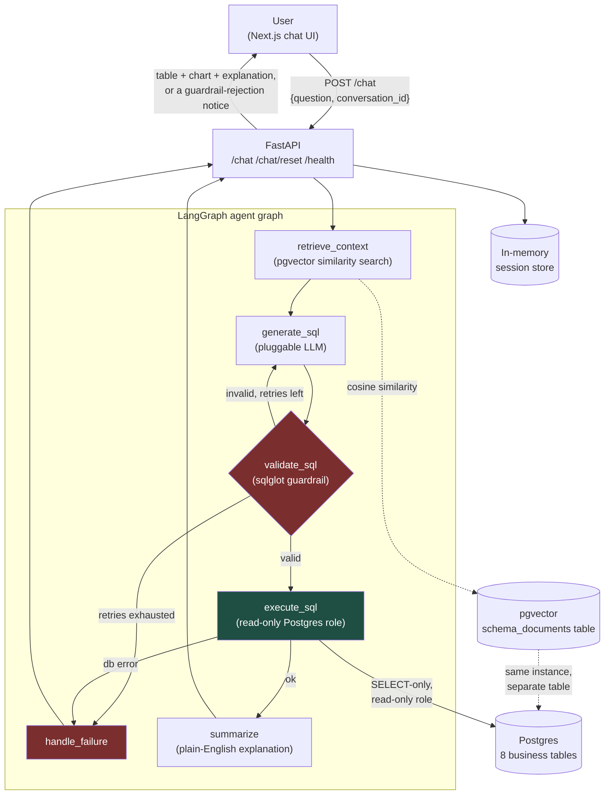

# QueryMind

**A natural-language-to-SQL analytics agent with RAG-grounded schema
retrieval, a SQL safety guardrail, multi-turn conversation, and a
labeled evaluation harness.**

Ask a question in plain English — *"What was transaction volume last
quarter by state?"* — and QueryMind retrieves the relevant database
schema and business-glossary context, generates a candidate SQL query
with an LLM, validates that it's read-only and in-scope before it ever
touches the database, executes it against a sandboxed Postgres
connection, and returns a table, an auto-picked chart, and a
plain-English explanation. Follow-up questions ("now filter to only
Karnataka") refine the conversation rather than starting over.

[](.github/workflows/ci.yml)
[]()

---

## Why this project exists

Built as a portfolio project for an SDE-I / data-engineering-leaning
full-stack role, to demonstrate end-to-end ownership of a realistic
applied-LLM system: schema design + synthetic data generation, RAG over
pgvector, an agentic graph (LangGraph) with an actual security boundary
(not just a demo), a full-stack chat UI, and — the part most portfolio
projects skip — a real, labeled evaluation harness rather than a claimed
accuracy number. See **[the eval results](#evaluation-results)** below
for exactly what was and wasn't measured, and why that distinction is
the whole point.

---

## Problem statement

Analysts and non-technical stakeholders at a fintech company need answers
from a transactional database, but writing correct SQL against an
unfamiliar schema — knowing that "volume" means *count* not *sum*, that
"settlement bank" and "issuing bank" are different columns on different
tables, that "success rate" excludes pending transactions — is a real
skill gap. QueryMind closes that gap with an agent that (a) knows the
schema and the business's own vocabulary via RAG, (b) is *structurally*
prevented from running anything unsafe regardless of what the LLM
proposes, and (c) explains itself in plain English rather than just
handing back a result set.

---

## Architecture



**The guardrail (`validate_sql`) is the load-bearing box in this
diagram.** It runs *before* any candidate query reaches Postgres, parses
the SQL with `sqlglot`, and rejects anything that isn't a single scoped
`SELECT`: multi-statement injection, any DML/DDL statement type, `SELECT
... INTO`, out-of-scope tables (including the agent's own `pgvector`
storage table — the agent can never surface its own infrastructure as a
query result), and a blocklist of functions with no legitimate place in
read-only analytics (`pg_sleep`, `pg_read_file`, `dblink`, …). A second,
independent layer — a Postgres role with `SELECT`-only grants and *no*
grants at all on the RAG table — backs this up at execution time, so a
bug in the guardrail isn't the only thing standing between a bad query
and the database. See [`tests/test_guardrails.py`](tests/test_guardrails.py)
for the executable proof, run on every push via CI.

---

## Tech stack

| Concern | Choice |
|---|---|
| LLM | Claude or GPT-4o via API, pluggable via `LLM_PROVIDER` env var (`anthropic` \| `openai` \| `mock`) |
| Orchestration | LangGraph (StateGraph with conditional retry/failure edges) |
| Vector store | pgvector (Postgres extension) — schema docs + business glossary |
| SQL safety | `sqlglot`-based guardrail: SELECT-only, scoped-table enforcement, function blocklist, row-limit capping |
| Backend | FastAPI (Python) |
| Frontend | Next.js 14 + React + TailwindCSS + Recharts |
| Evaluation | Custom eval harness — gold-SQL result comparison + retrieval recall@K, not text-matching |
| Observability | Structured per-node JSON logging (LangSmith wiring in place, activates automatically with a `LANGCHAIN_API_KEY`) |
| Containerization | Docker (backend), `docker-compose.yml` for local Postgres+pgvector+backend |
| CI/CD | GitHub Actions — guardrail unit tests + lint, an eval-harness smoke test against a real Postgres service container, and a Docker build/health check, on every push |
| Deployment | Render/Railway (backend, Docker), Vercel (frontend) — see [`DEPLOYMENT.md`](DEPLOYMENT.md) |
| Sample data | Synthetic UPI/card-style fintech transactions (`Faker("en_IN")`), 8 relational tables, no real data of any kind |

---

## Project layout

```
QueryMind/
├── backend/app/
│   ├── agent/        LangGraph graph, guardrail, pluggable LLM providers, tracing
│   ├── api/            FastAPI routes (/chat, /chat/reset, /health) + session store
│   ├── db/              Postgres connection helpers (incl. the read-only execution role)
│   ├── ingestion/        schema introspection + pgvector embedding scripts
│   └── retrieval/         retrieval sanity-check CLI
├── run_agent.py       CLI entrypoint (single question / --repl / --demo)
├── frontend/            Next.js + React + Tailwind chat UI
├── data/
│   ├── seed/             synthetic data generator, schema.sql, read-only-role SQL
│   └── schema_docs/       hand-written business glossary + generated table docs
├── eval/                 40-item labeled benchmark, harness, before/after report
├── tests/                 pytest suite for the SQL guardrail (CI-gated)
├── Dockerfile            backend container image
├── docker-compose.yml    Postgres+pgvector (+ backend, for local full-stack docker up)
├── .github/workflows/ci.yml
├── DEPLOYMENT.md         step-by-step Render + Vercel deployment guide
└── PROGRESS.md           phase-by-phase build log (all 5 phases)
```

---

## Setup — running it locally

Full step-by-step instructions for each phase (data seeding, the agent
CLI, the full-stack app, the eval harness) are in
**[`PROGRESS.md`](PROGRESS.md)**; the condensed path:

```bash
# 1. Config
cp .env.example .env        # fill in ANTHROPIC_API_KEY or OPENAI_API_KEY,
                             # or leave LLM_PROVIDER=mock to run without one

# 2. Database
docker compose up -d postgres
python data/seed/generate_data.py
python data/seed/seed_db.py
python backend/app/ingestion/introspect_schema.py
python backend/app/ingestion/embed_documents.py
psql "$DATABASE_URL" -f data/seed/create_readonly_role.sql    # for linux
# or
Get-Content data/seed/create_readonly_role.sql | docker compose exec -T postgres psql -U querymind -d querymind  # for windows

# 3. Backend
pip install -r requirements.txt
uvicorn backend.app.api.main:app --reload --port 8000

# 4. Frontend (second terminal)
cd frontend && npm install && npm run dev
# open http://localhost:3000
```

**Or, containerized end-to-end** (backend only needs the Postgres step
above run once, since seeding is a one-time operation, not part of the
app's runtime):
```bash
docker compose up --build        # postgres + backend, both containerized
cd frontend && npm install && npm run dev   # frontend still runs natively (Vercel-bound, not Dockerized)
```

**Running the tests:**
```bash
pip install -r requirements-dev.txt
pytest tests/ -v                                   # guardrail unit tests, no DB/API key needed
LLM_PROVIDER=mock python eval/run_eval.py --label local --verbose   # full harness, needs a seeded DB
```

---

## Evaluation results

The core deliverable of Phase 4/5 isn't a claimed accuracy number — it's
an honest, reusable harness. `eval/run_eval.py` runs the **real** agent
graph against a 40-item labeled benchmark (`eval/benchmark.json`: 8
simple lookups, 8 joins, 10 aggregations, 6 multi-turn pairs, 8
deliberately unsafe/out-of-scope requests), scoring **actual query
results against gold SQL** (order/phrasing-agnostic, Spider-style — not
brittle text-matching), plus retrieval recall@K, guardrail accuracy in
both directions (correctly rejecting unsafe queries *and* not
false-positive-rejecting safe ones), and latency.

| Metric | Before tuning | After tuning | Δ |
|---|---|---|---|
| SQL execution accuracy (produced & ran a query) | 100.0% | 100.0% | +0.0 pp |
| Result correctness (matches gold SQL's result) | 3.1% | 100.0% | +96.9 pp |
| Guardrail accuracy — unsafe items correctly rejected | 12.5% | 100.0% | +87.5 pp |
| False-positive rejection rate on safe items | 0.0% | 0.0% | — |
| Retrieval recall@K vs. labeled-relevant docs | 67.4% | 75.8% | +8.4 pp |
| Avg. latency / turn | 35.3 ms | 26.8 ms | — |

*(Full by-category breakdown, methodology, and a documented harness bug
found-and-fixed mid-phase: [`eval/REPORT.md`](eval/REPORT.md).)*

### ⚠️ What this table does and doesn't prove

**No `ANTHROPIC_API_KEY`/`OPENAI_API_KEY` was available in the sandbox
this was built in**, so every number above used a deterministic
keyword-matching stand-in (`LLM_PROVIDER=mock`/`mock_tuned`), not a real
model. That means:

- **Real and reusable as-is:** the harness itself, the gold-SQL
  benchmark, the scoring methodology, the retrieval-recall metric (which
  only depends on pgvector similarity search, not the LLM) and its
  measured `TOP_K_CONTEXT` improvement, and the latency figures — these
  are genuine measurements of a real system component.
- **NOT evidence of real NL2SQL quality:** the 100% result-correctness
  and guardrail numbers mostly measure how much of *this specific
  benchmark's phrasing* the mock's keyword-matcher was hand-extended to
  cover — a materially easier task than a real LLM generalizing to novel
  phrasing it wasn't tuned against.
- **To get the number that actually belongs on a resume:** set a real
  `LLM_PROVIDER` and re-run `eval/run_eval.py` — the harness, benchmark,
  and cost-tracking are already built and waiting for exactly that run
  (see `eval/REPORT.md`'s final section for the exact command).

This project's discipline throughout every phase has been to say plainly
what was and wasn't actually verified rather than implying more than was
tested — see [`PROGRESS.md`](PROGRESS.md) for the same pattern applied to
Docker access, API keys, and headless-browser screenshots across all five
phases.

---

## CI/CD

Every push runs [`.github/workflows/ci.yml`](.github/workflows/ci.yml):
guardrail unit tests + lint (fast, no external services), an eval-harness
smoke test against a real ephemeral Postgres+pgvector service container
(with `LLM_PROVIDER=mock` — a structural check that the pipeline still
runs end-to-end, not an accuracy gate), and a Docker build + container
health check.

## Deployment

Containerized backend (`Dockerfile`) deployable to Render or Railway;
frontend deployable to Vercel. Full step-by-step instructions — including
why this environment can't complete the actual account/click-through
steps for you — are in **[`DEPLOYMENT.md`](DEPLOYMENT.md)**.

---

## Demo

> 🎬 *Add a short screen-recording GIF or a few annotated screenshots
> here once deployed* — the most resume-relevant one to capture is the
> guardrail-rejection state (ask something like "delete all disputes"
> and show the clay-red rejected-query UI), since that's the single
> behavior that most differentiates this from a naive NL2SQL demo.

<!--


-->

| Placeholder | What to capture |
|---|---|
| `docs/demo.gif` | A full turn: type a question → SQL appears → table/chart renders → explanation |
| `docs/multiturn.png` | A follow-up question ("now filter to Karnataka") correctly narrowing the prior result |
| `docs/guardrail-rejection.png` | An unsafe request (e.g. a DELETE) being visibly rejected in the chat UI |

---

## Build log

This project was built in 5 phases, each with its own tested deliverable
and an honestly-documented "what's not verified yet." Full history,
decisions, and tradeoffs: **[`PROGRESS.md`](PROGRESS.md)**.

1. Data foundation + RAG retrieval proof-of-concept
2. LangGraph agent, SQL guardrails, multi-turn CLI
3. FastAPI backend + Next.js chat UI
4. Labeled eval benchmark + harness + one tuning pass
5. Containerization, CI/CD, deployment docs, and this README

---

## Resume bullets

*(Grounded in what was actually built and measured — see the caveats
above before using the eval numbers anywhere.)*

- Built a full-stack natural-language-to-SQL analytics agent (FastAPI +
  Next.js/React + LangGraph) with RAG-grounded schema retrieval over
  pgvector and multi-turn conversational follow-ups.
- Designed and implemented a defense-in-depth SQL safety layer
  (`sqlglot`-based static validation + a dedicated read-only Postgres
  role) that structurally blocks unsafe/out-of-scope queries regardless
  of LLM behavior, backed by a CI-gated pytest suite covering injection,
  DDL/DML, and infrastructure-table-access attempts.
- Built a labeled 40-item text-to-SQL evaluation harness that scores
  actual query results against gold SQL (not brittle text-matching),
  measuring execution accuracy, retrieval recall@K, and guardrail
  precision/recall independently — and used it to drive a measured
  +8.4pp retrieval-recall improvement via a retrieval-parameter tuning
  pass.
- Containerized the backend (Docker) and set up GitHub Actions CI running
  guardrail unit tests, an end-to-end pipeline smoke test against a live
  Postgres+pgvector service container, and a Docker build/health check on
  every push, with deployment configs for Render/Railway + Vercel.

## Project summary (LinkedIn / portfolio)

QueryMind is a natural-language-to-SQL analytics agent I built end-to-end:
ask a question in plain English, and it retrieves the right schema/
business-glossary context with RAG, generates SQL, validates it's safe
and read-only through a multi-layer guardrail before it ever touches the
database, and returns a table, chart, and plain-English explanation —
with multi-turn follow-ups. Beyond the agent itself, I built a labeled
evaluation harness that measures real query-result correctness and
retrieval quality rather than a hand-waved accuracy claim, and shipped it
with CI, Docker, and a documented deployment path. The project's guiding
principle throughout was to verify everything I could actually run and be
explicit about the one piece (live-model SQL-generation accuracy) I
couldn't test in this environment — the harness is built and ready for
that number the moment a model API key is attached.
